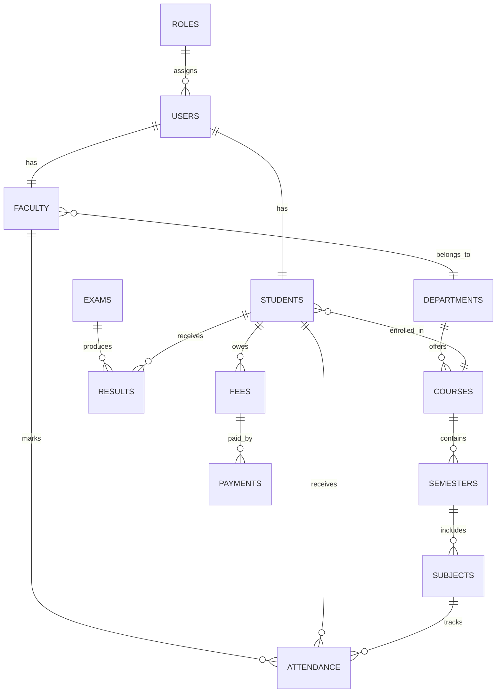

# Database Schema

```mermaid
erDiagram
  USERS ||--|| STUDENTS : has
  USERS ||--|| FACULTY : has
  ROLES ||--o{ USERS : assigns
  DEPARTMENTS ||--o{ COURSES : offers
  COURSES ||--o{ SEMESTERS : contains
  SEMESTERS ||--o{ SUBJECTS : includes
  STUDENTS }o--|| COURSES : enrolled_in
  FACULTY }o--|| DEPARTMENTS : belongs_to
  FACULTY ||--o{ ATTENDANCE : marks
  STUDENTS ||--o{ ATTENDANCE : receives
  SUBJECTS ||--o{ ATTENDANCE : tracks
  EXAMS ||--o{ RESULTS : produces
  STUDENTS ||--o{ RESULTS : receives
  STUDENTS ||--o{ FEES : owes
  FEES ||--o{ PAYMENTS : paid_by
```

Run `alembic upgrade head` to create the full schema. Migration history is in
`migrations/versions` and must be applied in order.
